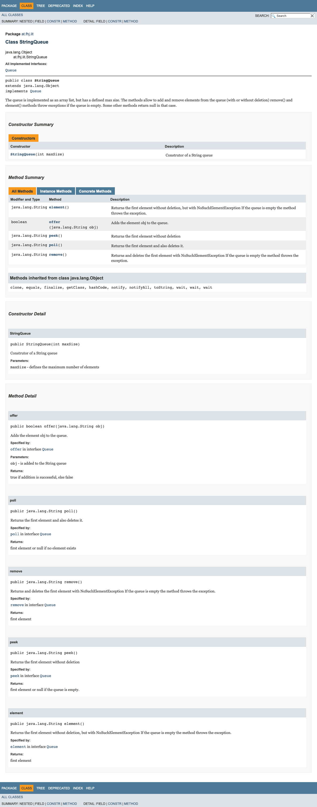
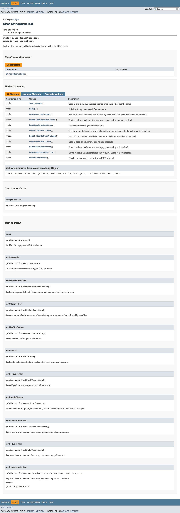
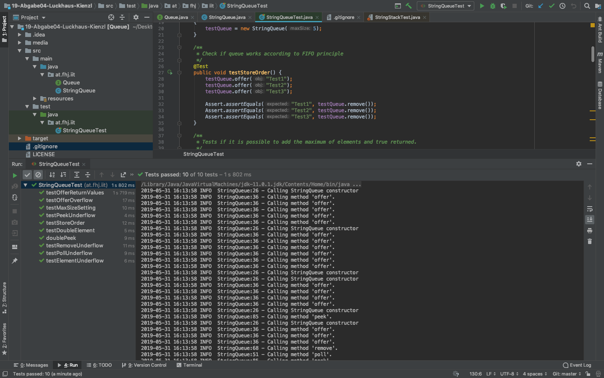
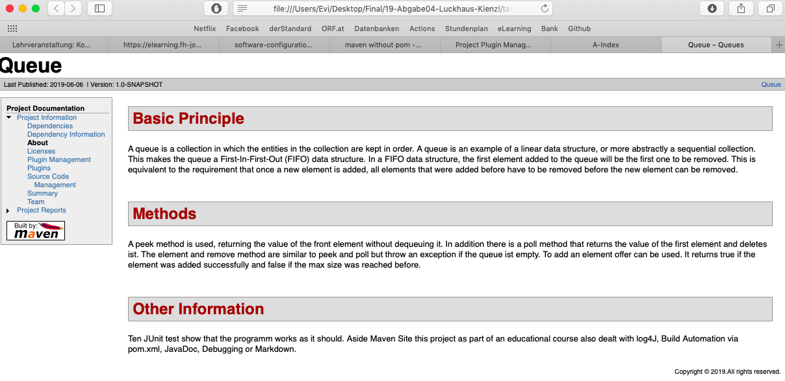
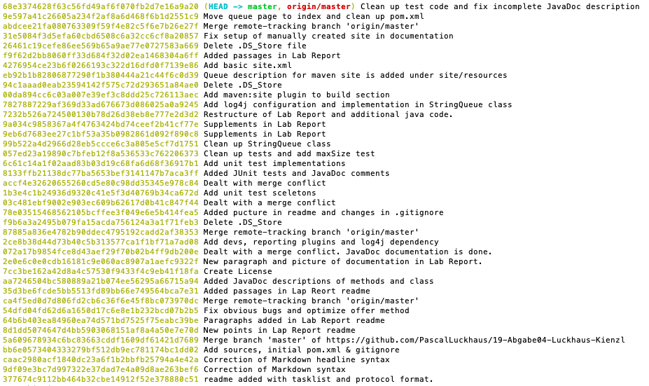
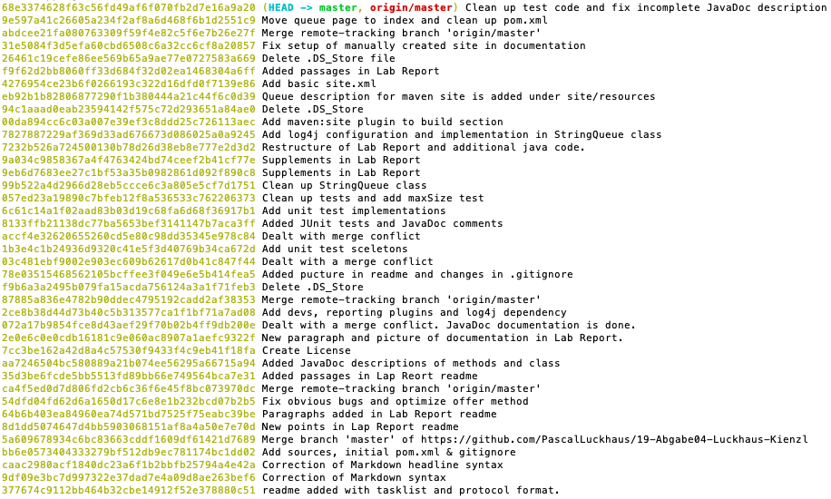

# Lab Report Vertiefende Gesamtwiederholung

Abgabe 04

Pascal Luckhaus

Eva-Maria Kienzl

Repository: [https://github.com/PascalLuckhaus/19-Abgabe04-Luckhaus-Kienzl.git](https://github.com/PascalLuckhaus/19-Abgabe04-Luckhaus-Kienzl.git)

Im Rahmen dieser Übung werden alle Lehrveranstaltungsinhalte von Konfigurationsmanagement gesammelt wiederholt. Dieses Dokument dient als Protokoll.

## Taskliste

- [X] Übertragen der Taskliste in Markdown Readme
- [X] Einspielen der Queue Vorlage
- [X] Korrigieren / Verbessern
- [X] Klassen- und Methodenkommentare mittels Javadoc
- [X] JUnit Tests erstellen
- [X] Programmtestung
- [X] Anpassen der pom.xml
- [X] Log4j integrieren
- [x] Maven Site Dokumentation
- [X] Erstellung und nachvollziehbarer Markdown Lab Report
- [X] Vollständigkeit der Abgabe überprüfen
- [ ] Abgabe PDF Version

-----

## Vorgehen
### Vorbereitungen
Bei der Erstellung des readme durch Eva wurde der Aufbau aus den bisherigen Lap Reports der Lehrveranstaltung übernommen sowie die Taskliste in einem ersten Schritt mit allen Hauptpunkten der Aufgaben erstellt. Nach anfänglichen kleinen Syntax-Problemen im Markdown war der erste Arbeitsauftrag erledigt.

**Anmerkung:** Sollten einzelne Punkte einer genaueren Aufschlüsselung bedürfen, weil die Arbeitsaufträge viel Zeit in Anspruch nehmen oder aufgeteilt werden sollen, sind diese in einem weiteren Schritt im Detail zu ergänzen.

Pascal hat währenddessen die Queue Vorlage ins Repository eingespielt (mit einem kleinem Merge Konflikt). Die pom.xml ist in der mitgelieferten Form enthalten und gitignore wurde erstellt.

### Korrektur des Codes
Gemeinsame Fehlersuche auf Pascals Laptop:
- Übergabeparameter bei Constructor richtig stellen
- poll()-Methode: Korrektur in if zu != anstelle von ==
- remove()-Methode: Entfernen der ständigen Überschreibung der Variable "Element" als leeres Element, nachdem die poll-Methode aufgerufen wurde.

**Anmerkung:** Wir müssen bei der Programmtestung herausfinden, ob die maxSize wirklich verwendet wird (aktuell als redundant angezeigt).

Pascal hat die Methoden dann zusätzlich etwas übersichtlicher gestaltet: Klammern, return-Werte, etc.

### JavaDoc
Die Klassen- und Methodenkommentare wurden von Eva verfasst und eine API Dokumentation in folgender Form über IntelliJ-Tools erzeugt:



### pom.xml
Ergänzung License und Entwicklerinformationen in der pom.xml durch Pascal.

### JUnit Tests
Wir haben gemeinsam überlegt welche JUnit Tests nötig sind und wie die bestehenden Methoden gemeinsam getestet werden können. Um unabhängig voneinander zeitgleich arbeiten zu können, haben wir die Methoden-Header erstellt und die Funktion abgestimmt. Danach hat jeder für sich die  aufgeteilten Tests umgesetzt und JavaDoc Kommentare bei den eigenen Tests ergänzt.

**Ein Beispiel eines Tests (Java Code):**
```
@Test (expected = NoSuchElementException.class)
    public void testRemoveUnderflow() throws Exception {
        testQueue.remove();
    }
```

Zur zuvorigen Anmerkung bezüglich maxSize, die in der StringQueue Klasse zugewiesen wird: Wir haben diese gelöscht, weil dem Constructor immer ein Wert mitübergeben wird. Die JavaDoc Info zu allen Tests:



Damit die Bilder zu JavaDoc in diesem Lab Report angezeigt werden können, musste der media-Ordner aus der .gitignore entfernt werden. Er ist somit ausnahmsweise Teil des Repositorys, obwohl die Inhalte der Screenshots eigentlich im Projekt generiert werden.

### log4j
Pascal hat die zwei Dependencys in der pom.xml ergänzt, die für Log4j nötig sind. Außerdem haben wir das properties-File vom Stack-Beispiel übernommen. Zusätzlich: Imortieren der nötigen Klassen und Erstellen eines Loggers. In jeder Methode wurde eine Info geloggt, dass die jeweilige Methode aufgerufen wird und vor jeder Exception wurde ein Error geloggt. So sieht das Ergebnis aus:



### Maven Site Dokumentation
Nach anfänglichen kleinen Schwierigkeiten, weil unter build im pom.xml das Maven Site Plugin gefehlt hat und der entsprechenden Ergänzung haben wir mvn site laufen lassen und eine erste Dokumentation erhalten. Um einen Menüpunkt zu ergänzen, haben wir die Inhalte im Ordner src/site/apt als index.apt ergänzt. Bevor mvn site erneut aufgerufen wird und der Link entsteht räumen wir mit mvn clean sicherheitshalber auf.

Hier das Ergebnis:



### Lab Report
Die Verfassung des Lap Reports ist OHNE Markdown Editor passiert. Deshalb kam es zu Beginn zu nötigen Richtigstellungen der Formatierungsbefehle. Für die Zukunft wäre ein entsprechender Editor, in dem die Formatierungsbefehle direkt ausgeführt werden, zu empfehlen.

Um auch noch ein wenig Python in Markdown einzubinden:

```
print("Goodbye, World!")
x = 1
if x == 1:
    # indented four spaces
    print("x is 1.")
```

Die Commits dieser Übung im Überblick:




-----

## Links / Literatur
Unterlagen aus den Vorlesungen und vorangegangenen Übungen. Weiterführende Links der Aufgabenstellung und MVN-Repository: [https://mvnrepository.com/artifact/org.apache.logging.log4j/log4j-api/2.11.2](https://mvnrepository.com/artifact/org.apache.logging.log4j/log4j-api/2.11.2)
